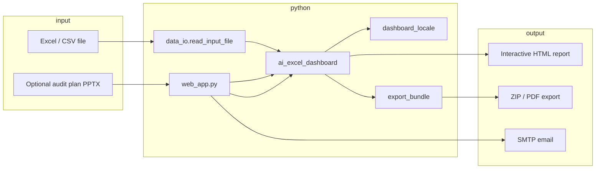

# Architecture

## High-level flow

## Two ways to run the same engine

| Mode | Entry file | User action |
|------|------------|-------------|
| **Web** | `web_app.py` | Browser upload at `/` → POST `/analyze` |
| **Desktop** | `ai_excel_dashboard.py` | Tk file picker → opens report in browser |

Both call **`generate_finance_report()`** in `ai_excel_dashboard.py`, which:

1. Loads the dataframe (`data_io`)
2. Detects columns (`resolve_audit_observation_columns`, `detect_primary_columns`)
3. Builds JSON payloads (`build_audit_observation_payload`, finance KPIs, logos)
4. Embeds payloads into a single HTML page (large inline JavaScript)
5. Optionally injects API URLs for email / PPTX parse (`web_app._inject_web_mail_api`)

## Important symbols in `ai_excel_dashboard.py`

| Symbol | Line area (approx.) | Role |
|--------|---------------------|------|
| `REPORT_VERSION` | top | Deploy tag; bump when report logic changes |
| `build_company_logo_catalog` | ~187 | Maps Company/Subcompany → logo images |
| `resolve_audit_observation_columns` | ~904 | Excel header → logical fields |
| `build_audit_observation_payload` | ~1035 | Rows + filters for audit UI |
| `_audit_observation_row_is_usable` | ~829 | Drops empty trailing Excel rows |
| `generate_finance_report` | ~1966 | Main HTML generator |
| `main` | ~12843 | Tk desktop entry |

Search the file for these names rather than reading top-to-bottom.

## Web-only pieces (`web_app.py`)

- Upload form HTML (`upload_form_html`, `index`)
- Multi-file analyze (`analyze`)
- `GET /api/version` — confirm deployed build
- `POST /api/send-obs-email` — uses `send_audit_observation_email_smtp`
- `POST /api/parse-audit-plan-pptx` — uses `parse_audit_plan_pptx_bytes`

## `exact_dashboard.py`

Separate code path that renders a **reference-style** dashboard from similar data. Used when integrating a fixed layout; not the main audit HTML most users see. Check `web_app.py` imports (`render_from_reference`) for when it runs.

## Future refactor (optional)

To make the repo easier long-term, consider splitting `ai_excel_dashboard.py` into:

- `audit_columns.py` — column resolution + payload
- `report_html/` — `.html` + `.js` templates
- `gui_app.py` — Tk only
- `smtp_helpers.py` — mail config

No refactor is required to run or deploy the current project.
