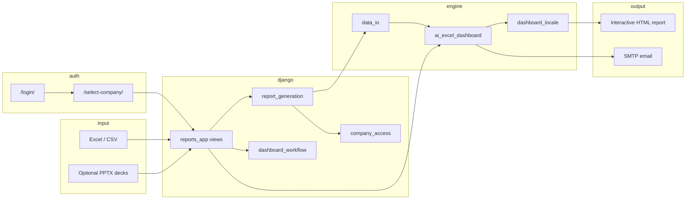

# Architecture

## High-level flow (active Django path)

## Runtime mode

| Mode | Entry | User action |
|------|------------|-------------|
| **Web (active)** | `manage.py` + `config/` | Login → company → upload → `/dashboards/` → serve |

Both the Django app and `python ai_excel_dashboard.py` (redirect) use the same report engine via **`generate_finance_report()`**, which:

1. Loads the dataframe (`data_io.read_input_file`)
2. Detects columns (`resolve_audit_observation_columns`, `detect_primary_columns`)
3. Builds JSON payloads (`build_audit_observation_payload`, finance KPIs, logos)
4. Embeds payloads into a single HTML page (inline JavaScript)
5. Injects API URLs for email / PPTX parse (`inject_web_mail_api` in `report_generation.py`)

## Upload architecture (store + lazy generate)

Legacy Flask-style “upload → HTML immediately” was removed. The active path:

1. **`store_upload_to_db`** — reads Excel, validates company tenant, stores rows as JSON in `UploadSession`, saves decks to `media/decks/`, creates `Dashboard` (draft).
2. **`generate_from_db_data`** — on `/dashboards/<id>/serve/`, rebuilds pandas from JSON and calls `generate_finance_report`.
3. Optional HTML cache under `media/dashboards/<id>_<locale>.html`.

## Authentication and multi-tenancy

| Layer | Module | Role |
|-------|--------|------|
| Login / 2FA / password expiry | `accounts_app` | Session auth |
| Active company in session | `accounts_app.middleware.ActiveCompanyMiddleware` | Tenant context on each request |
| Excel company validation | `audit_app.company_access` | Match upload to `Company.excel_company_names` |
| Dashboard permissions | `reports_app.dashboard_workflow` | Upload, view, review, delete |

## Important symbols in `ai_excel_dashboard.py`

| Symbol | Line (approx.) | Role |
|--------|----------------|------|
| `REPORT_VERSION` | top | Deploy tag |
| `build_company_logo_catalog` | ~187 | Company → logo images |
| `resolve_audit_observation_columns` | ~965 | Excel header → logical fields |
| `build_audit_observation_payload` | ~1096 | Rows + filters for audit UI |
| `_audit_observation_row_is_usable` | ~829 | Drops empty trailing Excel rows |
| `generate_finance_report` | ~2067 | Main HTML generator |
| `load_smtp_config` | ~12168 | SMTP from `.env` / environment |

Full index: **[CODE_MAP.md](CODE_MAP.md)**.

## Web API endpoints

| Endpoint | App | Purpose |
|----------|-----|---------|
| `/`, `/analyze` | `reports_app` | Upload form and processing |
| `/dashboards/` | `reports_app` | List, detail, serve, approve/reject |
| `/api/version` | `reports_app` | JSON build version |
| `/api/send-obs-email` | `mail_app` | Send observation email |
| `/api/parse-audit-plan-pptx` | `mail_app` | Parse audit plan PowerPoint |
| `/api/exports/health` | `exports_app` | Health check for monitoring |

## Future refactor (optional)

Splitting `ai_excel_dashboard.py` into smaller modules (columns, HTML templates, SMTP, GUI) would improve maintainability but is not required to run or deploy the current project.
