# Code map

Symbolic index for navigating the codebase, especially `ai_excel_dashboard.py` (~12,400 lines). Use search-by-name rather than reading the monolith top-to-bottom.

## Entry points

| Entry | File | Role |
|-------|------|------|
| Django CLI | `manage.py` | `runserver`, migrations, management commands |
| Django URLs | `config/urls.py` | Routes to all apps |
| Web server | `scripts/run_web.ps1` | Starts `runserver` on port 8000 |
| Report engine | `ai_excel_dashboard.generate_finance_report` (~L2067) | Builds interactive HTML report |
| Dev redirect | `ai_excel_dashboard.py` `__main__` | Runs `manage.py runserver` |

## Web request flow

```mermaid
flowchart LR
  login["/login/"] --> selectCo["/select-company/"]
  selectCo --> upload["/ upload"]
  upload --> analyze["POST /analyze"]
  analyze --> storeDB["store_upload_to_db"]
  storeDB --> list["/dashboards/"]
  list --> serve["/dashboards/id/serve/"]
  serve --> gen["generate_from_db_data"]
  gen --> engine["generate_finance_report"]
```

| Step | Symbol | File |
|------|--------|------|
| Login / 2FA | `login_view`, `verify_2fa_view` | `accounts_app/views.py` |
| Company session | `ActiveCompanyMiddleware`, `set_active_company` | `accounts_app/middleware.py`, `audit_app/company_access.py` |
| Upload form | `index`, `analyze` | `reports_app/views.py` |
| Store Excel JSON | `store_upload_to_db` | `reports_app/services/report_generation.py` |
| Workflow | `approve_dashboard`, `reject_dashboard`, `soft_delete_dashboard` | `reports_app/dashboard_workflow.py` |
| Serve HTML | `dashboard_serve`, `generate_from_db_data` | `reports_app/views.py`, `report_generation.py` |
| Version API | `api_version` | `reports_app/views.py` |

## Tenant and permissions

| Symbol | File | Role |
|--------|------|------|
| `user_companies`, `get_active_company` | `audit_app/company_access.py` | Multi-company access |
| `validate_excel_company_for_tenant` | `audit_app/company_access.py` | Excel Company column vs tenant |
| `extract_excel_company_names_from_df` | `audit_app/company_access.py` | Read company names from upload |
| `has_upload_perm`, `has_review_perm`, `has_view_perm` | `reports_app/dashboard_workflow.py` | Permission checks |
| `dashboards_queryset_for_user` | `reports_app/dashboard_workflow.py` | Scoped dashboard list |
| `Company`, `Dashboard`, `UploadSession` | `audit_app/models.py` | Persisted data |

## Report engine (`ai_excel_dashboard.py`)

| Symbol | ~Line | Role |
|--------|-------|------|
| `REPORT_VERSION` | top | Deploy tag; bump when report logic changes |
| `build_company_logo_catalog` | ~187 | Company/subcompany → logo paths |
| `resolve_audit_observation_columns` | ~965 | Excel headers → logical fields |
| `_audit_observation_row_is_usable` | ~829 | Filter empty trailing rows |
| `build_audit_observation_payload` | ~1096 | Rows + filters for audit UI |
| `build_multi_dashboard_shell` | ~1781 | Multi-workbook tab shell |
| `workbook_dashboard_tab_title` | ~1756 | Tab title from company column |
| **`generate_finance_report`** | **~2067** | **Main HTML/JS generator** |
| `content_fingerprint` | — | SHA256 for cache/dedup |
| `resolve_attached_deck_for_workbook_index` | — | Map deck uploads to workbook index |

### SMTP and mail API

| Symbol | ~Line | Role |
|--------|-------|------|
| `load_smtp_config`, `_smtp_config_from_env` | ~12120–12225 | Resolve SMTP from env/file |
| `send_audit_observation_email_smtp` | ~13006 | Send observation email |
| `parse_audit_plan_pptx_bytes` | ~13051 | Parse audit plan PPTX |
| `send_obs_email` | — | `mail_app/views.py` — Django API wrapper |
| `parse_audit_plan_pptx` | — | `mail_app/views.py` — Django API wrapper |

### Supporting modules (root)

| File | Role |
|------|------|
| `data_io.py` | `read_input_file` — Excel/CSV → pandas |
| `dashboard_locale.py` | `tr(loc, key)` — EN/AR strings |
| `web_strings.py` | Django shell UI strings (not iframe report) |

## Persistence

| Symbol | File | Role |
|--------|------|------|
| `persist_report_result` | `audit_app/services/persistence.py` | Save observations + audit payload |
| `UploadSession.raw_data_json` | `audit_app/models.py` | Stored Excel rows for lazy HTML gen |
| `Dashboard.source_files` | `audit_app/models.py` | Excel filenames + deck media paths |

## Django apps summary

| App | Responsibility |
|-----|----------------|
| `accounts_app` | Login, 2FA, password expiry, profile, company selection UI |
| `audit_app` | Models, admin, company access, persistence |
| `reports_app` | Upload, dashboard CRUD, serve, version endpoint |
| `mail_app` | `/api/send-obs-email`, `/api/parse-audit-plan-pptx` |
| `exports_app` | `/api/exports/health` — external monitoring |

## Management commands

| Command | Purpose |
|---------|---------|
| `create_default_admin` | First superuser |
| `setup_groups` | Permission groups |
| `setup_companies` | Tenant bootstrap |
| `test_smtp` | Verify SMTP configuration |

## Where to change what

| Goal | Start here |
|------|------------|
| Upload form / routes | `reports_app/views.py`, `templates/reports_app/upload.html` |
| Report charts, filters, layout | `ai_excel_dashboard.generate_finance_report` |
| Report English strings | `dashboard_locale.py` |
| Django shell strings | `web_strings.py`, `templates/` |
| Excel column aliases | `AUDIT_OBS_ALIASES`, `resolve_audit_observation_columns` |
| Company logos | `assets/logos/`, `build_company_logo_catalog` |
| Approve/reject workflow | `reports_app/dashboard_workflow.py` |
| New company / permissions | Django admin, `setup_companies` |

See also [ARCHITECTURE.md](ARCHITECTURE.md) and [FOLDER_MAP.md](FOLDER_MAP.md).
